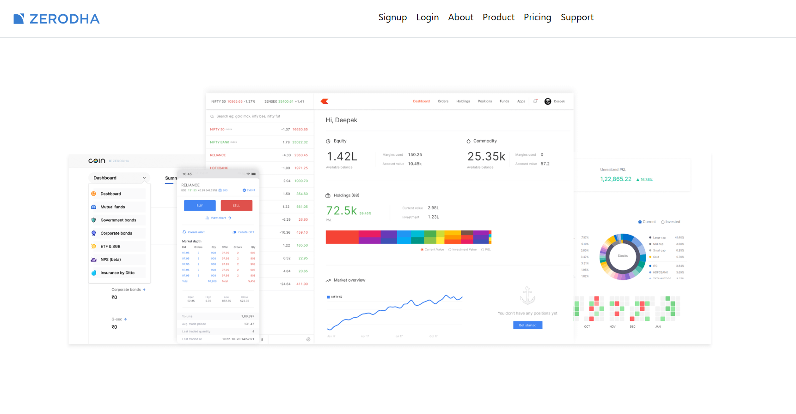
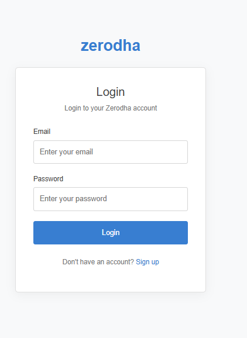
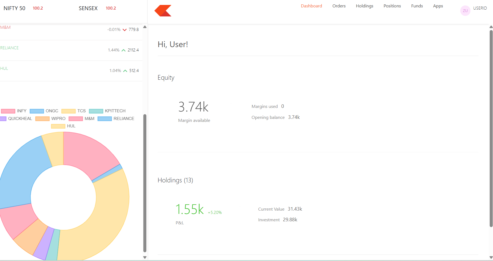
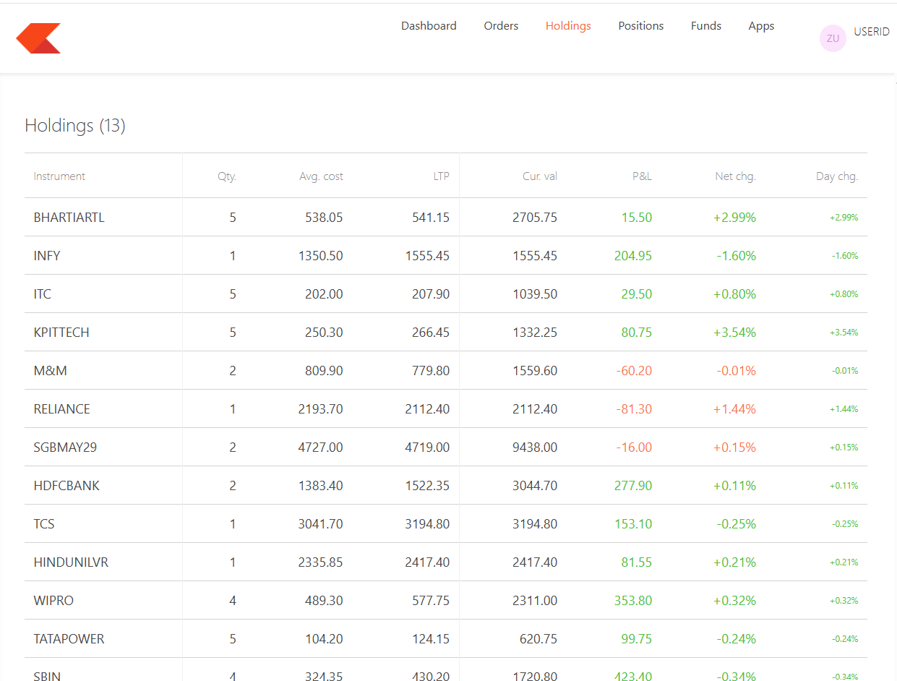
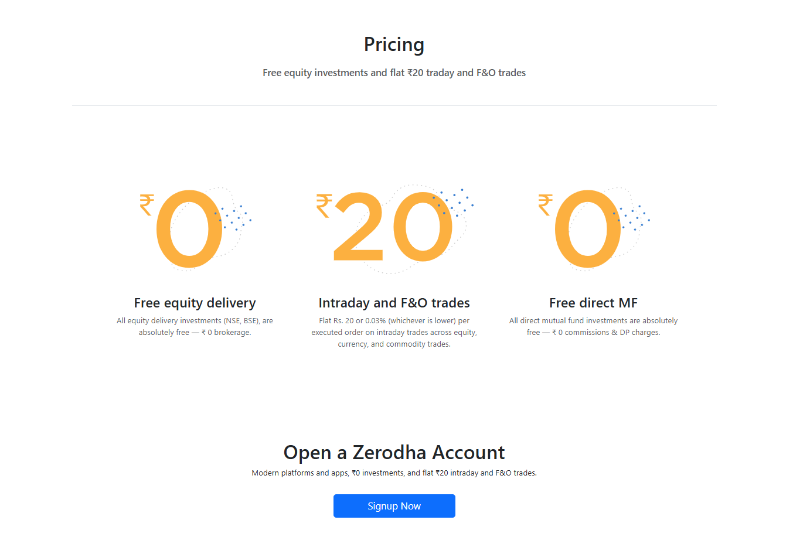
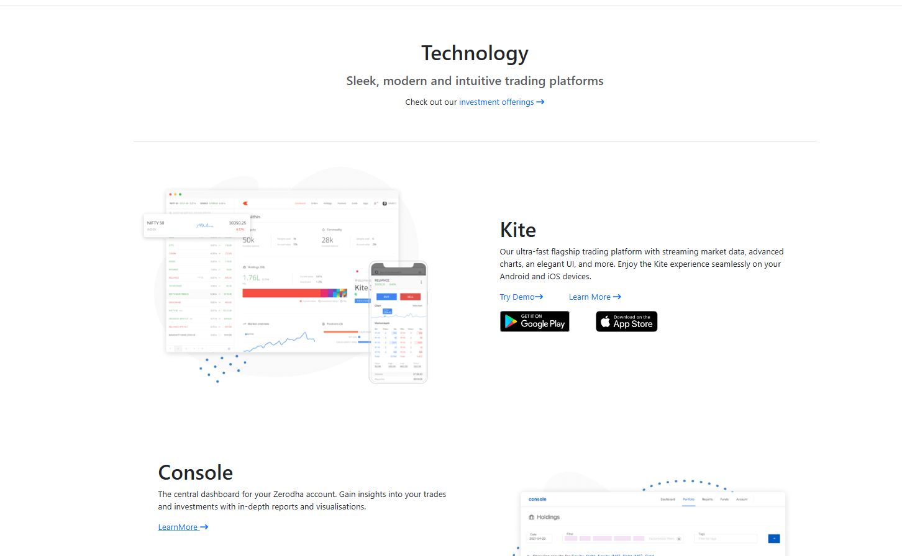
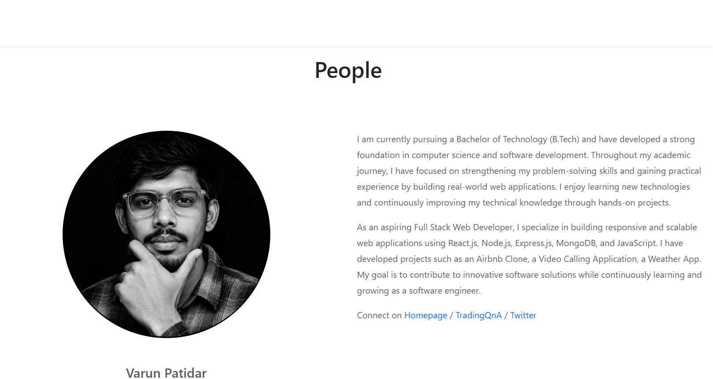

# 📈 Zerodha Clone

A full-stack **Zerodha-inspired stock trading dashboard** built using the MERN stack.  
This project includes a responsive landing page, user authentication, protected dashboard, holdings, positions, orders, funds, and other dashboard sections.

## 📑 Table of Contents

1. [Overview](#overview)
2. [Technologies](#technologies)
3. [Packages & Libraries Used](#packages--libraries-used)
4. [Getting Started](#getting-started)
5. [Setup](#setup)
6. [Features](#features)
7. [Demo & Screenshots](#demo--screenshots)


---

## 1. Overview

This project is a **Zerodha Clone** created for learning and practicing full-stack web development.

The application contains:

- A Zerodha-inspired landing page
- User Signup and Login
- JWT-based authentication
- Protected dashboard routes
- Holdings management
- Positions management
- Orders section
- Funds section
- Apps section
- Backend REST APIs
- MongoDB database integration
- Responsive dashboard interface

### 🌐 Live Demo
   
  **https://zerodha-dashboard-626r.onrender.com**

---

## 2. Technologies

### Frontend

- React.js
- React Router
- JavaScript
- HTML5
- CSS3
- Axios

### Backend

- Node.js
- Express.js
- MongoDB
- Mongoose
- JWT
- bcrypt / bcryptjs
- CORS
- Cookie-based authentication

### Deployment

- Render
- MongoDB Atlas
- GitHub

---

## 3. Packages & Libraries Used

### Frontend Packages

- `react`
- `react-dom`
- `react-router-dom`
- `axios`
- `react-scripts`

### Backend Packages

- `express`
- `mongoose`
- `bcryptjs`
- `jsonwebtoken`
- `cors`
- `cookie-parser`
- `dotenv`
- `nodemon`

---

## 4. Getting Started

To run this project locally, make sure you have the following installed:

- Node.js
- npm
- MongoDB / MongoDB Atlas
- Git

Clone the repository:

```bash
git clone https://github.com/Varun-Patidar/zerodha-clone.git
```

Go to the project directory:

```bash
cd zerodha-clone
```

The project contains three main folders:

```text
zerodha-clone/
├── dashboard/
├── backend/
└── frontend/
```

---

## 5. Setup

### Backend Setup

Open a terminal and go to the backend folder:

```bash
cd backend
```

Install dependencies:

```bash
npm install
```

Create a `.env` file inside the `backend` folder:

```env
MONGO_URL=your_mongodb_connection_string
TOKEN_KEY=your_jwt_secret
PORT=3002
```

Start the backend:

```bash
node index.js
```

For development with nodemon:

```bash
npx nodemon index.js
```

---

### Dashboard Setup

Open another terminal:

```bash
cd dashboard
```

Install dependencies:

```bash
npm install
```

Start the React application:

```bash
npm start
```

The dashboard will normally run at:

```text
http://localhost:3000
```

---

## 6. Features

### 🔐 Authentication

- User Signup
- User Login
- Password hashing
- JWT authentication
- HTTP-only authentication cookies
- Protected dashboard routes
- User Logout

### 📊 Dashboard

- Dashboard overview
- Holdings
- Positions
- Orders
- Funds
- Apps
- User profile/menu

### 📦 Trading Features

- View holdings data
- View positions data
- Create new orders
- Display order information
- Backend API integration

### 🌐 Frontend

- React-based UI
- React Router navigation
- Protected routes
- Axios API requests
- Zerodha-inspired design
- Responsive layout

### 🗄️ Backend

- Express REST APIs
- MongoDB database
- Mongoose models
- Authentication middleware
- CORS configuration
- Environment variable support

---

## 7. Demo & Screenshots

### 🌐 Live Demo

**Frontend:**  
https://zerodha-dashboard-626r.onrender.com

### 🏠 Home Page



### 🔐 Login Page



### 📊 Dashboard



### 📈 Holdings



### 💰 Pricing Page



### 📦 Products Page



### 📖 About Page

